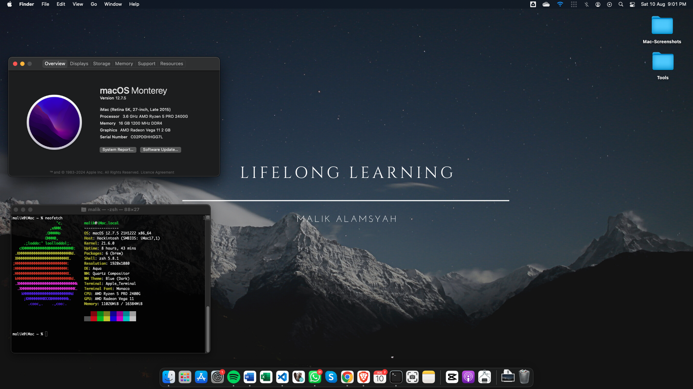

# EFI hackintosh-dell-optiplex-5055

## PC Specs :

- <b>Processor</b>: AMD Ryzen 5 PRO 2400G  
- <b>iGPU</b>: AMD Radeon Vega 11 2 GB  
- <b>Storage</b>: MidasForce SSD 120GB
- <b>Ram</b>: 16GB DDR4 
- <b>Wireless</b>: [TP-Link - TL-WN823N](https://s.shopee.co.id/9KOMdGtVVc)
- <b>Bluetooth</b>: [TP-LiNK - UB400](https://s.shopee.co.id/2qAstOL6Yr)
- <b>Audio Codec</b>: ALC255
- <b>MacOs Version</b>: Monterey 12.7.5
- <b>Installer</b>: Olarilla

## 📈 Working
- [x] USB Ports
- [x] HDMI port & audio
- [x] Internal Audio, Internal Mic, & Headphone Jack
- [x] Wifi & Bluetooth

## 📉 Not Working / Unstable
- [ ] LAN (Broadcom NetXtreme BCM5762 PCI-E Gigabit Ethernet)
- [ ] Docker